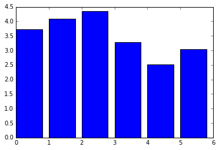
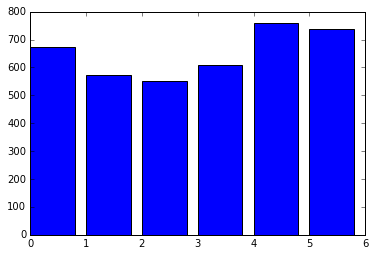
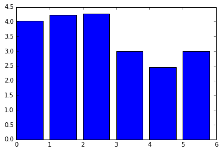
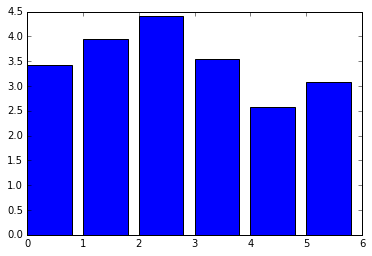
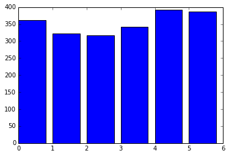
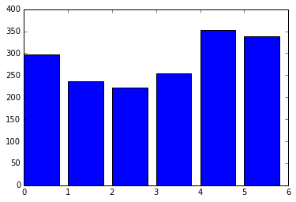

# Guided Project: Star Wars Survey

While waiting for Star Wars: The Force Awakens to come out, the team at FiveThirtyEight became interested in answering some questions about Star Wars fans. In particular, they wondered: does the rest of America realize that “The Empire Strikes Back” is clearly the best of the bunch?

The team needed to collect data addressing this question. To do this, they surveyed Star Wars fans using the online tool SurveyMonkey. They received 835 total responses, which you download from their GitHub repository.

For this project, you'll be cleaning and exploring the data set in Jupyter notebook. To see a sample notebook containing all of the answers, visit the project's GitHub repository.

The data has several columns, including:

* RespondentID - An anonymized ID for the respondent (person taking the survey)
* Gender - The respondent's gender
* Age - The respondent's age
* Household Income - The respondent's income
* Education - The respondent's education level
* Location (Census Region) - The respondent's location
* Have you seen any of the 6 films in the Star Wars franchise? - Has a Yes or No response
* Do you consider yourself to be a fan of the Star Wars film franchise? - Has a Yes or No response

There are several other columns containing answers to questions about the Star Wars movies. For some questions, the respondent had to check one or more boxes. This type of data is difficult to represent in columnar format. As a result, this data set needs a lot of cleaning.

## Reading in the data


```python
import pandas as pd
star_wars = pd.read_csv("star_wars.csv", encoding="ISO-8859-1")
```

## Explore the data and remove invalid rows
First, you'll need to remove the invalid rows. For example, RespondentID is supposed to be a unique ID for each respondent, but it's blank in some rows. You'll need to remove any rows with an invalid RespondentID.


```python
star_wars = star_wars[pd.notnull(star_wars["RespondentID"])]
```


```python
star_wars.head()
```


<div>
<style scoped>
    .dataframe tbody tr th:only-of-type {
        vertical-align: middle;
    }

    .dataframe tbody tr th {
        vertical-align: top;
    }

    .dataframe thead th {
        text-align: right;
    }
</style>
<table border="1" class="dataframe">
  <thead>
    <tr style="text-align: right;">
      <th></th>
      <th>RespondentID</th>
      <th>Have you seen any of the 6 films in the Star Wars franchise?</th>
      <th>Do you consider yourself to be a fan of the Star Wars film franchise?</th>
      <th>Which of the following Star Wars films have you seen? Please select all that apply.</th>
      <th>Unnamed: 4</th>
      <th>Unnamed: 5</th>
      <th>Unnamed: 6</th>
      <th>Unnamed: 7</th>
      <th>Unnamed: 8</th>
      <th>Please rank the Star Wars films in order of preference with 1 being your favorite film in the franchise and 6 being your least favorite film.</th>
      <th>...</th>
      <th>Unnamed: 28</th>
      <th>Which character shot first?</th>
      <th>Are you familiar with the Expanded Universe?</th>
      <th>Do you consider yourself to be a fan of the Expanded Universe?ξ</th>
      <th>Do you consider yourself to be a fan of the Star Trek franchise?</th>
      <th>Gender</th>
      <th>Age</th>
      <th>Household Income</th>
      <th>Education</th>
      <th>Location (Census Region)</th>
    </tr>
  </thead>
  <tbody>
    <tr>
      <th>1</th>
      <td>3.292880e+09</td>
      <td>Yes</td>
      <td>Yes</td>
      <td>Star Wars: Episode I  The Phantom Menace</td>
      <td>Star Wars: Episode II  Attack of the Clones</td>
      <td>Star Wars: Episode III  Revenge of the Sith</td>
      <td>Star Wars: Episode IV  A New Hope</td>
      <td>Star Wars: Episode V The Empire Strikes Back</td>
      <td>Star Wars: Episode VI Return of the Jedi</td>
      <td>3</td>
      <td>...</td>
      <td>Very favorably</td>
      <td>I don't understand this question</td>
      <td>Yes</td>
      <td>No</td>
      <td>No</td>
      <td>Male</td>
      <td>18-29</td>
      <td>NaN</td>
      <td>High school degree</td>
      <td>South Atlantic</td>
    </tr>
    <tr>
      <th>2</th>
      <td>3.292880e+09</td>
      <td>No</td>
      <td>NaN</td>
      <td>NaN</td>
      <td>NaN</td>
      <td>NaN</td>
      <td>NaN</td>
      <td>NaN</td>
      <td>NaN</td>
      <td>NaN</td>
      <td>...</td>
      <td>NaN</td>
      <td>NaN</td>
      <td>NaN</td>
      <td>NaN</td>
      <td>Yes</td>
      <td>Male</td>
      <td>18-29</td>
      <td>$0 - $24,999</td>
      <td>Bachelor degree</td>
      <td>West South Central</td>
    </tr>
    <tr>
      <th>3</th>
      <td>3.292765e+09</td>
      <td>Yes</td>
      <td>No</td>
      <td>Star Wars: Episode I  The Phantom Menace</td>
      <td>Star Wars: Episode II  Attack of the Clones</td>
      <td>Star Wars: Episode III  Revenge of the Sith</td>
      <td>NaN</td>
      <td>NaN</td>
      <td>NaN</td>
      <td>1</td>
      <td>...</td>
      <td>Unfamiliar (N/A)</td>
      <td>I don't understand this question</td>
      <td>No</td>
      <td>NaN</td>
      <td>No</td>
      <td>Male</td>
      <td>18-29</td>
      <td>$0 - $24,999</td>
      <td>High school degree</td>
      <td>West North Central</td>
    </tr>
    <tr>
      <th>4</th>
      <td>3.292763e+09</td>
      <td>Yes</td>
      <td>Yes</td>
      <td>Star Wars: Episode I  The Phantom Menace</td>
      <td>Star Wars: Episode II  Attack of the Clones</td>
      <td>Star Wars: Episode III  Revenge of the Sith</td>
      <td>Star Wars: Episode IV  A New Hope</td>
      <td>Star Wars: Episode V The Empire Strikes Back</td>
      <td>Star Wars: Episode VI Return of the Jedi</td>
      <td>5</td>
      <td>...</td>
      <td>Very favorably</td>
      <td>I don't understand this question</td>
      <td>No</td>
      <td>NaN</td>
      <td>Yes</td>
      <td>Male</td>
      <td>18-29</td>
      <td>$100,000 - $149,999</td>
      <td>Some college or Associate degree</td>
      <td>West North Central</td>
    </tr>
    <tr>
      <th>5</th>
      <td>3.292731e+09</td>
      <td>Yes</td>
      <td>Yes</td>
      <td>Star Wars: Episode I  The Phantom Menace</td>
      <td>Star Wars: Episode II  Attack of the Clones</td>
      <td>Star Wars: Episode III  Revenge of the Sith</td>
      <td>Star Wars: Episode IV  A New Hope</td>
      <td>Star Wars: Episode V The Empire Strikes Back</td>
      <td>Star Wars: Episode VI Return of the Jedi</td>
      <td>5</td>
      <td>...</td>
      <td>Somewhat favorably</td>
      <td>Greedo</td>
      <td>Yes</td>
      <td>No</td>
      <td>No</td>
      <td>Male</td>
      <td>18-29</td>
      <td>$100,000 - $149,999</td>
      <td>Some college or Associate degree</td>
      <td>West North Central</td>
    </tr>
  </tbody>
</table>
<p>5 rows × 38 columns</p>
</div>


### List columns


```python
star_wars.columns
```


    Index(['RespondentID',
           'Have you seen any of the 6 films in the Star Wars franchise?',
           'Do you consider yourself to be a fan of the Star Wars film franchise?',
           'Which of the following Star Wars films have you seen? Please select all that apply.',
           'Unnamed: 4', 'Unnamed: 5', 'Unnamed: 6', 'Unnamed: 7', 'Unnamed: 8',
           'Please rank the Star Wars films in order of preference with 1 being your favorite film in the franchise and 6 being your least favorite film.',
           'Unnamed: 10', 'Unnamed: 11', 'Unnamed: 12', 'Unnamed: 13',
           'Unnamed: 14',
           'Please state whether you view the following characters favorably, unfavorably, or are unfamiliar with him/her.',
           'Unnamed: 16', 'Unnamed: 17', 'Unnamed: 18', 'Unnamed: 19',
           'Unnamed: 20', 'Unnamed: 21', 'Unnamed: 22', 'Unnamed: 23',
           'Unnamed: 24', 'Unnamed: 25', 'Unnamed: 26', 'Unnamed: 27',
           'Unnamed: 28', 'Which character shot first?',
           'Are you familiar with the Expanded Universe?',
           'Do you consider yourself to be a fan of the Expanded Universe?ξ',
           'Do you consider yourself to be a fan of the Star Trek franchise?',
           'Gender', 'Age', 'Household Income', 'Education',
           'Location (Census Region)'],
          dtype='object')


Convert the "Have you seen any of the 6 films in the Star Wars franchise?" and "Do you consider yourself to be a fan of the Star Wars film franchise?" columns to the Boolean type.


```python
yes_no = {"Yes": True, "No": False}

for col in [
    "Have you seen any of the 6 films in the Star Wars franchise?",
    "Do you consider yourself to be a fan of the Star Wars film franchise?"
    ]:
    star_wars[col] = star_wars[col].map(yes_no)

star_wars.head()
```


<div>
<style scoped>
    .dataframe tbody tr th:only-of-type {
        vertical-align: middle;
    }

    .dataframe tbody tr th {
        vertical-align: top;
    }

    .dataframe thead th {
        text-align: right;
    }
</style>
<table border="1" class="dataframe">
  <thead>
    <tr style="text-align: right;">
      <th></th>
      <th>RespondentID</th>
      <th>Have you seen any of the 6 films in the Star Wars franchise?</th>
      <th>Do you consider yourself to be a fan of the Star Wars film franchise?</th>
      <th>Which of the following Star Wars films have you seen? Please select all that apply.</th>
      <th>Unnamed: 4</th>
      <th>Unnamed: 5</th>
      <th>Unnamed: 6</th>
      <th>Unnamed: 7</th>
      <th>Unnamed: 8</th>
      <th>Please rank the Star Wars films in order of preference with 1 being your favorite film in the franchise and 6 being your least favorite film.</th>
      <th>...</th>
      <th>Unnamed: 28</th>
      <th>Which character shot first?</th>
      <th>Are you familiar with the Expanded Universe?</th>
      <th>Do you consider yourself to be a fan of the Expanded Universe?ξ</th>
      <th>Do you consider yourself to be a fan of the Star Trek franchise?</th>
      <th>Gender</th>
      <th>Age</th>
      <th>Household Income</th>
      <th>Education</th>
      <th>Location (Census Region)</th>
    </tr>
  </thead>
  <tbody>
    <tr>
      <th>1</th>
      <td>3.292880e+09</td>
      <td>NaN</td>
      <td>NaN</td>
      <td>Star Wars: Episode I  The Phantom Menace</td>
      <td>Star Wars: Episode II  Attack of the Clones</td>
      <td>Star Wars: Episode III  Revenge of the Sith</td>
      <td>Star Wars: Episode IV  A New Hope</td>
      <td>Star Wars: Episode V The Empire Strikes Back</td>
      <td>Star Wars: Episode VI Return of the Jedi</td>
      <td>3</td>
      <td>...</td>
      <td>Very favorably</td>
      <td>I don't understand this question</td>
      <td>Yes</td>
      <td>No</td>
      <td>No</td>
      <td>Male</td>
      <td>18-29</td>
      <td>NaN</td>
      <td>High school degree</td>
      <td>South Atlantic</td>
    </tr>
    <tr>
      <th>2</th>
      <td>3.292880e+09</td>
      <td>NaN</td>
      <td>NaN</td>
      <td>NaN</td>
      <td>NaN</td>
      <td>NaN</td>
      <td>NaN</td>
      <td>NaN</td>
      <td>NaN</td>
      <td>NaN</td>
      <td>...</td>
      <td>NaN</td>
      <td>NaN</td>
      <td>NaN</td>
      <td>NaN</td>
      <td>Yes</td>
      <td>Male</td>
      <td>18-29</td>
      <td>$0 - $24,999</td>
      <td>Bachelor degree</td>
      <td>West South Central</td>
    </tr>
    <tr>
      <th>3</th>
      <td>3.292765e+09</td>
      <td>NaN</td>
      <td>NaN</td>
      <td>Star Wars: Episode I  The Phantom Menace</td>
      <td>Star Wars: Episode II  Attack of the Clones</td>
      <td>Star Wars: Episode III  Revenge of the Sith</td>
      <td>NaN</td>
      <td>NaN</td>
      <td>NaN</td>
      <td>1</td>
      <td>...</td>
      <td>Unfamiliar (N/A)</td>
      <td>I don't understand this question</td>
      <td>No</td>
      <td>NaN</td>
      <td>No</td>
      <td>Male</td>
      <td>18-29</td>
      <td>$0 - $24,999</td>
      <td>High school degree</td>
      <td>West North Central</td>
    </tr>
    <tr>
      <th>4</th>
      <td>3.292763e+09</td>
      <td>NaN</td>
      <td>NaN</td>
      <td>Star Wars: Episode I  The Phantom Menace</td>
      <td>Star Wars: Episode II  Attack of the Clones</td>
      <td>Star Wars: Episode III  Revenge of the Sith</td>
      <td>Star Wars: Episode IV  A New Hope</td>
      <td>Star Wars: Episode V The Empire Strikes Back</td>
      <td>Star Wars: Episode VI Return of the Jedi</td>
      <td>5</td>
      <td>...</td>
      <td>Very favorably</td>
      <td>I don't understand this question</td>
      <td>No</td>
      <td>NaN</td>
      <td>Yes</td>
      <td>Male</td>
      <td>18-29</td>
      <td>$100,000 - $149,999</td>
      <td>Some college or Associate degree</td>
      <td>West North Central</td>
    </tr>
    <tr>
      <th>5</th>
      <td>3.292731e+09</td>
      <td>NaN</td>
      <td>NaN</td>
      <td>Star Wars: Episode I  The Phantom Menace</td>
      <td>Star Wars: Episode II  Attack of the Clones</td>
      <td>Star Wars: Episode III  Revenge of the Sith</td>
      <td>Star Wars: Episode IV  A New Hope</td>
      <td>Star Wars: Episode V The Empire Strikes Back</td>
      <td>Star Wars: Episode VI Return of the Jedi</td>
      <td>5</td>
      <td>...</td>
      <td>Somewhat favorably</td>
      <td>Greedo</td>
      <td>Yes</td>
      <td>No</td>
      <td>No</td>
      <td>Male</td>
      <td>18-29</td>
      <td>$100,000 - $149,999</td>
      <td>Some college or Associate degree</td>
      <td>West North Central</td>
    </tr>
  </tbody>
</table>
<p>5 rows × 38 columns</p>
</div>


Convert the columns: 
 * "Which of the following Star Wars films have you seen? Please select all that apply." 
 * "Unnamed 4"
 * "Unnamed 5"
 * "Unnamed 6"
 * "Unnamed 7" 
so that it only contains the values True and False.

*  You can select the column names more quickly by entering star_wars.columns[3:9], rather than typing them out.

*  Be very careful with spacing when constructing your mapping dictionary! In the cells, Star Wars: Episode I The Phantom Menace has two spaces between the end of Episode I and the start of The Phantom, but this is not the case in Star Wars: Episode VI Return of the Jedi. Check the values in the cells carefully to make sure you use the appropriate spacing.

* Rename each of the columns above so the names are more intuitive. We recommend using seen_1 to indicate whether the respondent saw Star Wars: Episode I The Phantom Menace, seen_2 for Star Wars: Episode II Attack of the Clones, and so on.


```python
import numpy as np

movie_mapping = {
    "Star Wars: Episode I  The Phantom Menace": True,
    np.nan: False,
    "Star Wars: Episode II  Attack of the Clones": True,
    "Star Wars: Episode III  Revenge of the Sith": True,
    "Star Wars: Episode IV  A New Hope": True,
    "Star Wars: Episode V The Empire Strikes Back": True,
    "Star Wars: Episode VI Return of the Jedi": True
}

for col in star_wars.columns[3:9]:
    star_wars[col] = star_wars[col].map(movie_mapping)
```

### Rename columns


```python
star_wars = star_wars.rename(columns={
        "Which of the following Star Wars films have you seen? Please select all that apply.": "seen_1",
        "Unnamed: 4": "seen_2",
        "Unnamed: 5": "seen_3",
        "Unnamed: 6": "seen_4",
        "Unnamed: 7": "seen_5",
        "Unnamed: 8": "seen_6"
        })

star_wars = star_wars.rename(columns={
        "Please rank the Star Wars films in order of preference with 1 being your favorite film in the franchise and 6 being your least favorite film.": "ranking_1",
        "Unnamed: 10": "ranking_2",
        "Unnamed: 11": "ranking_3",
        "Unnamed: 12": "ranking_4",
        "Unnamed: 13": "ranking_5",
        "Unnamed: 14": "ranking_6"
        })

star_wars.head()
```


<div>
<style scoped>
    .dataframe tbody tr th:only-of-type {
        vertical-align: middle;
    }

    .dataframe tbody tr th {
        vertical-align: top;
    }

    .dataframe thead th {
        text-align: right;
    }
</style>
<table border="1" class="dataframe">
  <thead>
    <tr style="text-align: right;">
      <th></th>
      <th>RespondentID</th>
      <th>Have you seen any of the 6 films in the Star Wars franchise?</th>
      <th>Do you consider yourself to be a fan of the Star Wars film franchise?</th>
      <th>seen_1</th>
      <th>seen_2</th>
      <th>seen_3</th>
      <th>seen_4</th>
      <th>seen_5</th>
      <th>seen_6</th>
      <th>ranking_1</th>
      <th>...</th>
      <th>Unnamed: 28</th>
      <th>Which character shot first?</th>
      <th>Are you familiar with the Expanded Universe?</th>
      <th>Do you consider yourself to be a fan of the Expanded Universe?ξ</th>
      <th>Do you consider yourself to be a fan of the Star Trek franchise?</th>
      <th>Gender</th>
      <th>Age</th>
      <th>Household Income</th>
      <th>Education</th>
      <th>Location (Census Region)</th>
    </tr>
  </thead>
  <tbody>
    <tr>
      <th>1</th>
      <td>3.292880e+09</td>
      <td>NaN</td>
      <td>NaN</td>
      <td>True</td>
      <td>True</td>
      <td>True</td>
      <td>True</td>
      <td>True</td>
      <td>True</td>
      <td>3</td>
      <td>...</td>
      <td>Very favorably</td>
      <td>I don't understand this question</td>
      <td>Yes</td>
      <td>No</td>
      <td>No</td>
      <td>Male</td>
      <td>18-29</td>
      <td>NaN</td>
      <td>High school degree</td>
      <td>South Atlantic</td>
    </tr>
    <tr>
      <th>2</th>
      <td>3.292880e+09</td>
      <td>NaN</td>
      <td>NaN</td>
      <td>False</td>
      <td>False</td>
      <td>False</td>
      <td>False</td>
      <td>False</td>
      <td>False</td>
      <td>NaN</td>
      <td>...</td>
      <td>NaN</td>
      <td>NaN</td>
      <td>NaN</td>
      <td>NaN</td>
      <td>Yes</td>
      <td>Male</td>
      <td>18-29</td>
      <td>$0 - $24,999</td>
      <td>Bachelor degree</td>
      <td>West South Central</td>
    </tr>
    <tr>
      <th>3</th>
      <td>3.292765e+09</td>
      <td>NaN</td>
      <td>NaN</td>
      <td>True</td>
      <td>True</td>
      <td>True</td>
      <td>False</td>
      <td>False</td>
      <td>False</td>
      <td>1</td>
      <td>...</td>
      <td>Unfamiliar (N/A)</td>
      <td>I don't understand this question</td>
      <td>No</td>
      <td>NaN</td>
      <td>No</td>
      <td>Male</td>
      <td>18-29</td>
      <td>$0 - $24,999</td>
      <td>High school degree</td>
      <td>West North Central</td>
    </tr>
    <tr>
      <th>4</th>
      <td>3.292763e+09</td>
      <td>NaN</td>
      <td>NaN</td>
      <td>True</td>
      <td>True</td>
      <td>True</td>
      <td>True</td>
      <td>True</td>
      <td>True</td>
      <td>5</td>
      <td>...</td>
      <td>Very favorably</td>
      <td>I don't understand this question</td>
      <td>No</td>
      <td>NaN</td>
      <td>Yes</td>
      <td>Male</td>
      <td>18-29</td>
      <td>$100,000 - $149,999</td>
      <td>Some college or Associate degree</td>
      <td>West North Central</td>
    </tr>
    <tr>
      <th>5</th>
      <td>3.292731e+09</td>
      <td>NaN</td>
      <td>NaN</td>
      <td>True</td>
      <td>True</td>
      <td>True</td>
      <td>True</td>
      <td>True</td>
      <td>True</td>
      <td>5</td>
      <td>...</td>
      <td>Somewhat favorably</td>
      <td>Greedo</td>
      <td>Yes</td>
      <td>No</td>
      <td>No</td>
      <td>Male</td>
      <td>18-29</td>
      <td>$100,000 - $149,999</td>
      <td>Some college or Associate degree</td>
      <td>West North Central</td>
    </tr>
  </tbody>
</table>
<p>5 rows × 38 columns</p>
</div>


* Convert each of the columns above to a float type.
    * You can select all of the column names with star_wars.columns[9:15], rather than typing each one in.
* Give each column a more descriptive name. We suggest ranking_1, ranking_2, and so on.
    * You can use the df.rename() method from the last screen to accomplish this.


```python
star_wars[star_wars.columns[9:15]] = star_wars[star_wars.columns[9:15]].astype(float)
```

* Use the pandas.DataFrame.mean() method to compute the mean of each of the ranking columns from the last screen.
* Make a bar chart of each ranking. You can use a matplotlib bar chart for this.
    * Make sure to run %matplotlib inline beforehand to show your plots in the notebook.


```python
star_wars[star_wars.columns[9:15]].mean()
```


    ranking_1    3.732934
    ranking_2    4.087321
    ranking_3    4.341317
    ranking_4    3.272727
    ranking_5    2.513158
    ranking_6    3.047847
    dtype: float64


```python
%matplotlib inline
import matplotlib.pyplot as plt

plt.bar(range(6), star_wars[star_wars.columns[9:15]].mean())
```


    <Container object of 6 artists>





## Rankings
So far, we've cleaned up the data, renamed several columns, and computed the average ranking of each movie. As I suspected, it looks like the "original" movies are rated much more highly than the newer ones.


```python
star_wars[star_wars.columns[3:9]].sum()
```


    seen_1    673
    seen_2    571
    seen_3    550
    seen_4    607
    seen_5    758
    seen_6    738
    dtype: int64


```python
plt.bar(range(6), star_wars[star_wars.columns[3:9]].sum())
```


    <Container object of 6 artists>





## View counts
It appears that the original movies were seen by more respondents than the newer movies. This reinforces what we saw in the rankings, where the earlier movies seem to be more popular.

* Split the data into two groups based on one of the binary columns above.
* Redo the two previous analyses (find the most viewed movie and the highest-ranked movie) separately for each group, and then compare the results.


```python
males = star_wars[star_wars["Gender"] == "Male"]
females = star_wars[star_wars["Gender"] == "Female"]
```


```python
plt.bar(range(6), males[males.columns[9:15]].mean())
plt.show()

plt.bar(range(6), females[females.columns[9:15]].mean())
plt.show()
```








```python
plt.bar(range(6), males[males.columns[3:9]].sum())
plt.show()

plt.bar(range(6), females[females.columns[3:9]].sum())
plt.show()
```








## Male/Female differences in favorite Star Wars movie and most seen movie¶
Interestingly, more males watches episodes 1-3, but males liked them far less than females did.


```python

```
